<html lang="en">
<head>
  <meta charset="UTF-8">
  <meta name="viewport" content="width=device-width, initial-scale=1.0">
  <title>Prestige Rooter - Trusted Plumbing Services in Brooklyn, NY</title>
  <meta name="description" content="Prestige Rooter, a family-owned plumbing company since 2005, offers reliable services to over 20,000 customers in Brooklyn, Staten Island, and New Jersey.">
  
  
  
</head>
<body class="font-sans text-gray-800 bg-gray-50" id="body">
  <!-- Header -->
  <header class="gradient-bg text-white sticky top-0 z-40 shadow-lg">
    

      

        <!-- Logo -->
        

          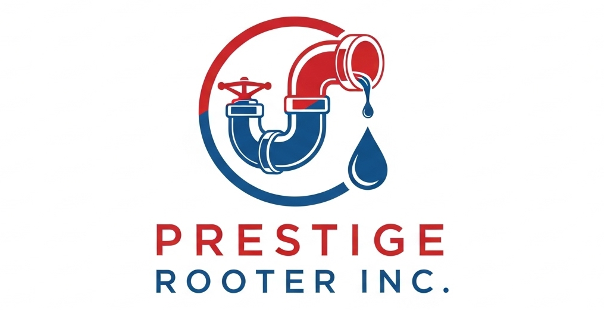
          

            <h1 class="text-xl font-bold">Prestige Rooter</h1>
            
Since 2005

          

        

        <!-- Desktop Navigation -->
        <nav class="desktop-nav hidden lg:flex space-x-6 items-center">
          <a href="#home" class="text-lg hover:text-yellow-300 transition-colors" data-en="Home" data-ru="Главная">Home</a>
          <a href="#about" class="text-lg hover:text-yellow-300 transition-colors" data-en="About" data-ru="О нас">About</a>
          <a href="#services" class="text-lg hover:text-yellow-300 transition-colors" data-en="Services" data-ru="Услуги">Services</a>
          <a href="#testimonials" class="text-lg hover:text-yellow-300 transition-colors" data-en="Testimonials" data-ru="Отзывы">Testimonials</a>
          <a href="#contact" class="text-lg hover:text-yellow-300 transition-colors" data-en="Contact" data-ru="Контакты">Contact</a>
          <button class="text-lg hover:text-yellow-300 transition-colors" onclick="toggleLanguage()">🇺🇸/🇷🇺</button>
        </nav>

        <!-- CTA Button (Desktop) -->
        <a href="#contact" class="hidden lg:block bg-yellow-500 text-blue-900 px-6 py-3 rounded-lg hover:bg-yellow-400 transition-colors font-semibold" data-en="Get Free Quote" data-ru="Получить Расчет">Get Free Quote</a>

        <!-- Mobile Menu Button -->
        <button class="mobile-menu-button lg:hidden" onclick="toggleMobileMenu()">
          <svg class="w-6 h-6" fill="none" stroke="currentColor" viewBox="0 0 24 24">
            <path stroke-linecap="round" stroke-linejoin="round" stroke-width="2" d="M4 6h16M4 12h16M4 18h16"></path>
          </svg>
        </button>
      

      <!-- Mobile Menu -->
      

        <nav class="flex flex-col space-y-3 pt-4">
          <a href="#home" class="text-lg hover:text-yellow-300 transition-colors" onclick="closeMobileMenu()" data-en="Home" data-ru="Главная">Home</a>
          <a href="#about" class="text-lg hover:text-yellow-300 transition-colors" onclick="closeMobileMenu()" data-en="About" data-ru="О нас">About</a>
          <a href="#services" class="text-lg hover:text-yellow-300 transition-colors" onclick="closeMobileMenu()" data-en="Services" data-ru="Услуги">Services</a>
          <a href="#testimonials" class="text-lg hover:text-yellow-300 transition-colors" onclick="closeMobileMenu()" data-en="Testimonials" data-ru="Отзывы">Testimonials</a>
          <a href="#contact" class="text-lg hover:text-yellow-300 transition-colors" onclick="closeMobileMenu()" data-en="Contact" data-ru="Контакты">Contact</a>
          <button class="text-lg hover:text-yellow-300 transition-colors text-left" onclick="toggleLanguage()">🇺🇸/🇷🇺 Language</button>
          <a href="#contact" class="bg-yellow-500 text-blue-900 px-6 py-3 rounded-lg hover:bg-yellow-400 transition-colors font-semibold text-center mt-4" onclick="closeMobileMenu()" data-en="Get Free Quote" data-ru="Получить Расчет">Get Free Quote</a>
        </nav>
      

    

  </header>

  <!-- Hero Section -->
  <section id="home" class="hero-gradient text-white py-16 lg:py-24">
    

      <h1 class="text-3xl md:text-4xl lg:text-6xl font-bold mb-6 leading-tight" data-en="Trusted Plumbing Solutions Since 2005" data-ru="Надежные Сантехнические Решения с 2005">Trusted Plumbing Solutions Since 2005</h1>
      
Prestige Rooter, a family-owned and operated plumbing company, delivers reliable, high-quality services to Brooklyn, Staten Island, and New Jersey.

      
      

        <a href="tel:347-276-3160" class="bg-red-600 hover:bg-red-700 text-white px-8 py-4 rounded-lg font-semibold text-lg transition-colors flex items-center">
          📞 Call Now: 347-276-3160
        </a>
      

      

        

          <h3 class="text-xl font-semibold mb-2" data-en="24/7 Emergency Service" data-ru="Экстренная Служба 24/7">24/7 Emergency Service</h3>
          
Available when you need us most

        

        

          <h3 class="text-xl font-semibold mb-2" data-en="20,000+ Happy Customers" data-ru="20 000+ Довольных Клиентов">20,000+ Happy Customers</h3>
          
Trusted by families & businesses

        

        

          <h3 class="text-xl font-semibold mb-2" data-en="Licensed & Insured" data-ru="Лицензированы и Застрахованы">Licensed & Insured</h3>
          
Professional service guaranteed

        

      

    

  </section>

  <!-- About Section -->
  <section id="about" class="py-16 lg:py-24">
    

      <h2 class="text-3xl lg:text-4xl font-bold text-center mb-12" data-en="About Prestige Rooter" data-ru="О Prestige Rooter">About Prestige Rooter</h2>
      

        

          
Established in 2005, Prestige Rooter Inc. is a family-owned and operated plumbing company proudly serving Brooklyn, Staten Island, and parts of New Jersey. With over 20,000 satisfied residential and commercial clients, we've built a reputation for being the go-to team for reliable, honest, and top-quality plumbing services.

          
          
Based in Sheepshead Bay, our expert technicians specialize in everything from emergency drain cleaning and sewer line repairs to advanced camera inspections, water heater installations, radiant heating systems, and full-service plumbing solutions.

          

            

              
19+

              
Years Experience

            

            

              
20K+

              
Happy Customers

            

          

        

        

          
          

          

            <h3 class="text-xl font-semibold mb-2" data-en="Our Mission" data-ru="Наша Миссия">Our Mission</h3>
            
Getting the job done right the first time

          

        

      

    

  </section>

  <!-- Services Section -->
  <section id="services" class="bg-white py-16 lg:py-24 relative overflow-visible">
    

      <h2 class="text-3xl lg:text-4xl font-bold text-center mb-12" data-en="Our Services" data-ru="Наши Услуги">Our Services</h2>
      

        <!-- Emergency Plumbing -->
        

          
🚨

          <h3 class="text-lg font-semibold mb-2" data-en="Emergency Plumbing" data-ru="Аварийная Сантехника">Emergency Plumbing</h3>
          
24/7 Emergency Response

          

            <ul class="text-left text-sm space-y-1">
              <li>• 24/7 Emergency Response</li>
              <li>• Burst Pipe Repair</li>
              <li>• Overflowing Toilets</li>
              <li>• Flood Response & Cleanup</li>
              <li>• Emergency Leak Detection</li>
            </ul>
          

        

        <!-- Drain & Sewer Services -->
        

          
🚽

          <h3 class="text-lg font-semibold mb-2" data-en="Drain & Sewer Services" data-ru="Услуги по Дренажу и Канализации">Drain & Sewer Services</h3>
          
Complete drain solutions

          

            <ul class="text-left text-sm space-y-1">
              <li>• Drain Cleaning</li>
              <li>• Sewer Line Cleaning</li>
              <li>• Sewer Line Repairs & Replacement</li>
              <li>• Hydro Jetting / High-Pressure Water Jet</li>
              <li>• Video Camera Pipe Inspections</li>
              <li>• Root Intrusion Removal</li>
              <li>• Grease Trap Cleaning (Commercial)</li>
            </ul>
          

        

        <!-- Pipe Services -->
        

          
🔧

          <h3 class="text-lg font-semibold mb-2" data-en="Pipe Services" data-ru="Услуги по Трубам">Pipe Services</h3>
          
Expert pipe solutions

          

            <ul class="text-left text-sm space-y-1">
              <li>• Pipe Cleaning & Maintenance</li>
              <li>• Pipe Repair & Repiping</li>
              <li>• Frozen Pipe Thawing</li>
              <li>• Leak Detection & Sealing</li>
              <li>• Trenchless Pipe Repair</li>
              <li>• Gas Line Installation & Repair</li>
            </ul>
          

        

        <!-- Bathroom Plumbing -->
        

          
🚿

          <h3 class="text-lg font-semibold mb-2" data-en="Bathroom Plumbing" data-ru="Сантехника для Ванной">Bathroom Plumbing</h3>
          
Complete bathroom solutions

          

            <ul class="text-left text-sm space-y-1">
              <li>• Toilet Repairs & Replacements</li>
              <li>• Faucet & Sink Installation</li>
              <li>• Shower & Bathtub Plumbing</li>
              <li>• Clog Removal</li>
              <li>• Water Pressure Fixes</li>
              <li>• Bathroom Renovation Plumbing</li>
            </ul>
          

        

        <!-- Kitchen Plumbing -->
        

          
🍽️

          <h3 class="text-lg font-semibold mb-2" data-en="Kitchen Plumbing" data-ru="Сантехника для Кухни">Kitchen Plumbing</h3>
          
Kitchen installation & repair

          

            <ul class="text-left text-sm space-y-1">
              <li>• Sink & Faucet Installation</li>
              <li>• Garbage Disposal Repair/Replacement</li>
              <li>• Dishwasher Hookups</li>
              <li>• Ice Maker Line Installation</li>
              <li>• Instant Hot Water Dispenser Installation</li>
              <li>• Grease Clog Removal</li>
            </ul>
          

        

        <!-- Water Heater Services -->
        

          
🌡️

          <h3 class="text-lg font-semibold mb-2" data-en="Water Heater Services" data-ru="Услуги по Водонагревателям">Water Heater Services</h3>
          
Tank & tankless solutions

          

            <ul class="text-left text-sm space-y-1">
              <li>• Water Heater Installation (Tank & Tankless)</li>
              <li>• Water Heater Repairs</li>
              <li>• Water Heater Maintenance</li>
              <li>• Expansion Tank Installation</li>
              <li>• Hot Water Supply Troubleshooting</li>
            </ul>
          

        

        <!-- Heating & Boiler Services -->
        

          
🔥

          <h3 class="text-lg font-semibold mb-2" data-en="Heating & Boiler Services" data-ru="Услуги по Отоплению и Котлам">Heating & Boiler Services</h3>
          
Heating system experts

          

            <ul class="text-left text-sm space-y-1">
              <li>• Boiler Installation & Replacement</li>
              <li>• Boiler Repair & Maintenance</li>
              <li>• Radiant Floor Heating Installation</li>
              <li>• Baseboard Heating Systems</li>
              <li>• Thermostat & Zone Control Installations</li>
            </ul>
          

        

        <!-- Commercial Plumbing Services -->
        

          
🏢

          <h3 class="text-lg font-semibold mb-2" data-en="Commercial Plumbing Services" data-ru="Коммерческие Сантехнические Услуги">Commercial Plumbing Services</h3>
          
Business & industrial solutions

          

            <ul class="text-left text-sm space-y-1">
              <li>• Plumbing for Multi-Unit Buildings</li>
              <li>• Restaurant & Retail Plumbing</li>
              <li>• Backflow Prevention & Testing</li>
              <li>• Water Main Installation</li>
              <li>• Industrial Drainage Systems</li>
              <li>• Maintenance Contracts</li>
            </ul>
          

        

        <!-- Filtration & Water Quality -->
        

          
💧

          <h3 class="text-lg font-semibold mb-2" data-en="Filtration & Water Quality" data-ru="Фильтрация и Качество Воды">Filtration & Water Quality</h3>
          
Clean water solutions

          

            <ul class="text-left text-sm space-y-1">
              <li>• Water Filtration Systems</li>
              <li>• Water Softener Installations</li>
              <li>• Lead Pipe Replacement</li>
              <li>• Reverse Osmosis Systems</li>
            </ul>
          

        

        <!-- General Installation & Plumbing Renovations -->
        

          
🏠

          <h3 class="text-lg font-semibold mb-2" data-en="General Installation & Plumbing Renovations" data-ru="Общие Установки и Реконструкции Сантехники">General Installation & Plumbing Renovations</h3>
          
Complete renovation services

          

            <ul class="text-left text-sm space-y-1">
              <li>• New Construction Plumbing</li>
              <li>• Whole-Home Repiping</li>
              <li>• Plumbing Inspections (Pre-Purchase)</li>
              <li>• Permitting & Code Compliance</li>
            </ul>
          

        

      

    

  </section>

  <!-- Portfolio Section -->
  <section id="portfolio" class="py-16 lg:py-24 bg-gray-50">
    

      <h2 class="text-3xl lg:text-4xl font-bold text-center mb-8" data-en="Our Portfolio" data-ru="Наш Портфель">Our Portfolio</h2>
      
Explore some of our completed residential/commercial projects showcasing Prestige Rooter's quality and expertise.

      

        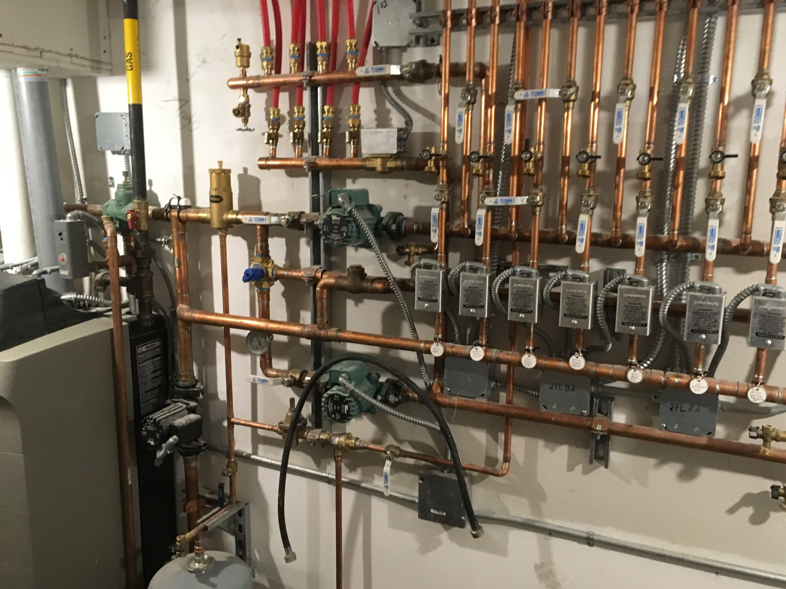
        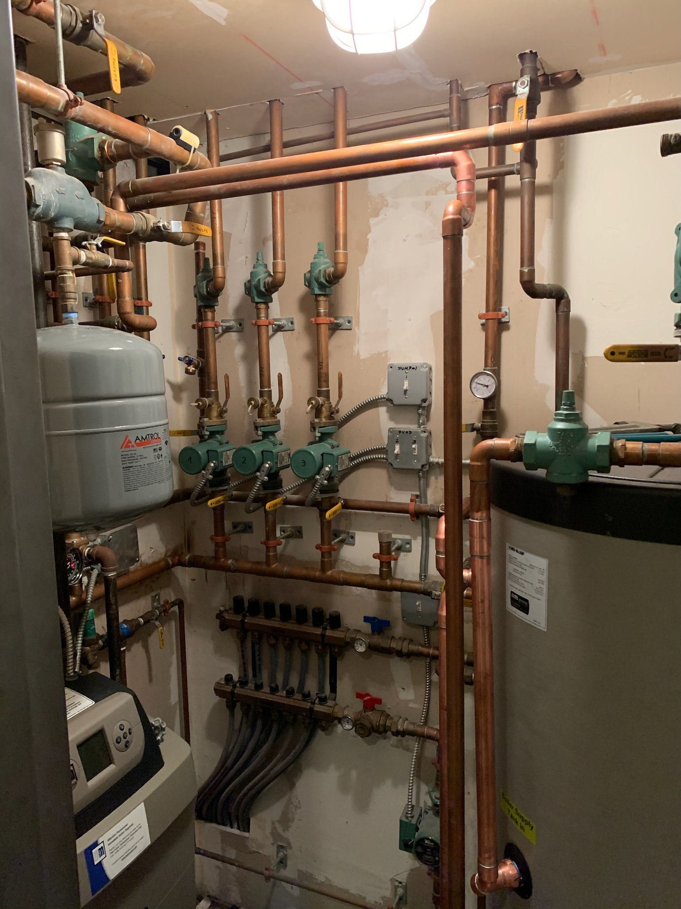
        
        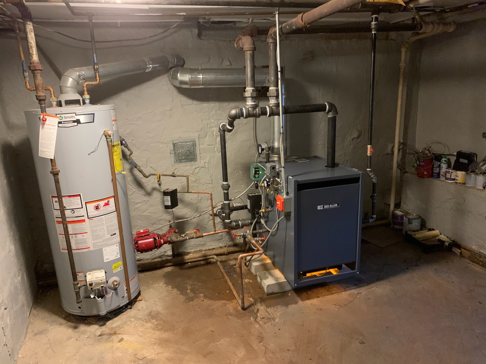
        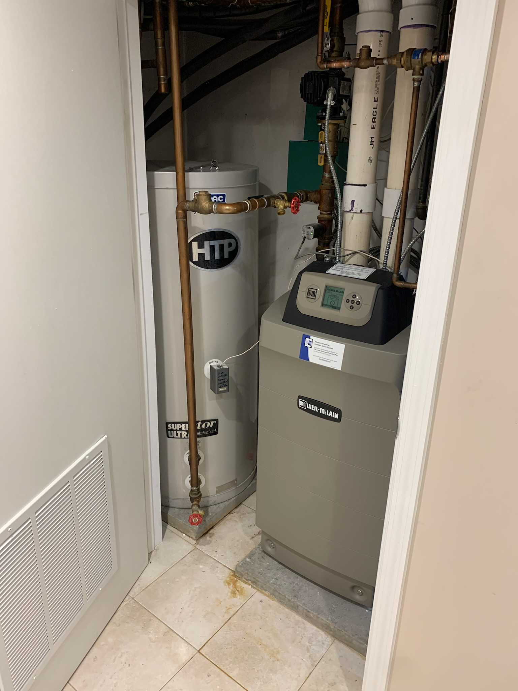
        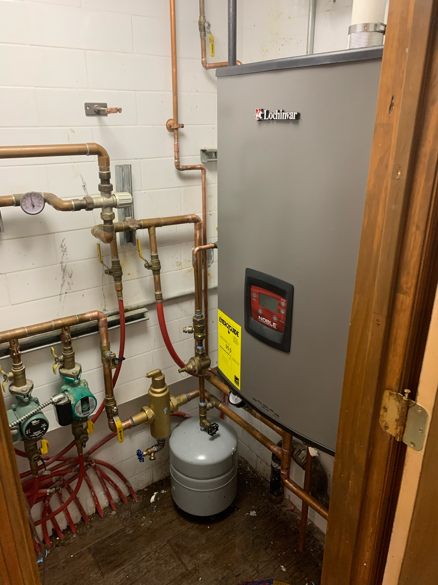
        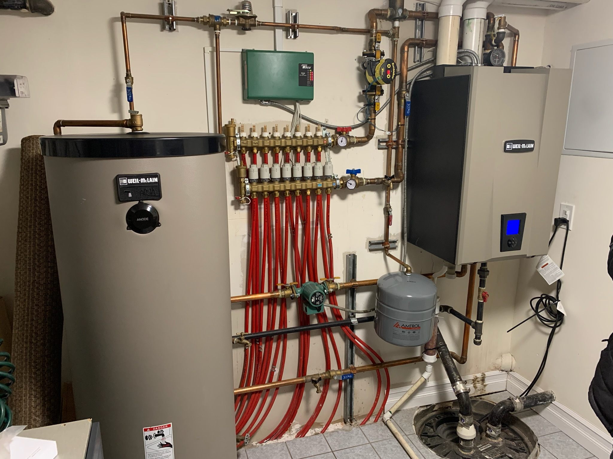
        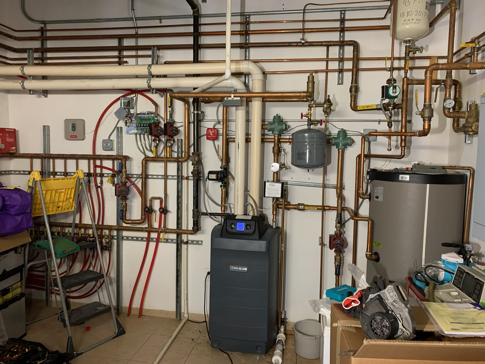
        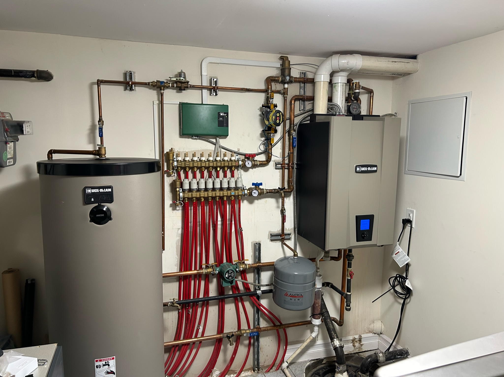
        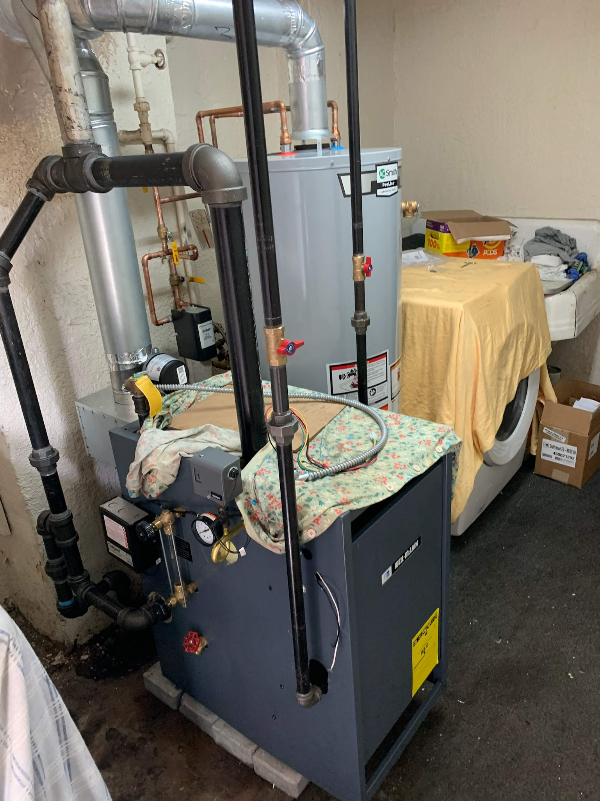
        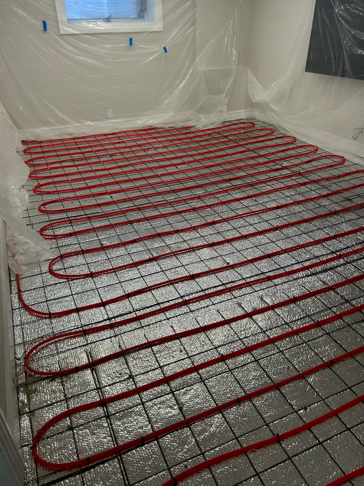
        
        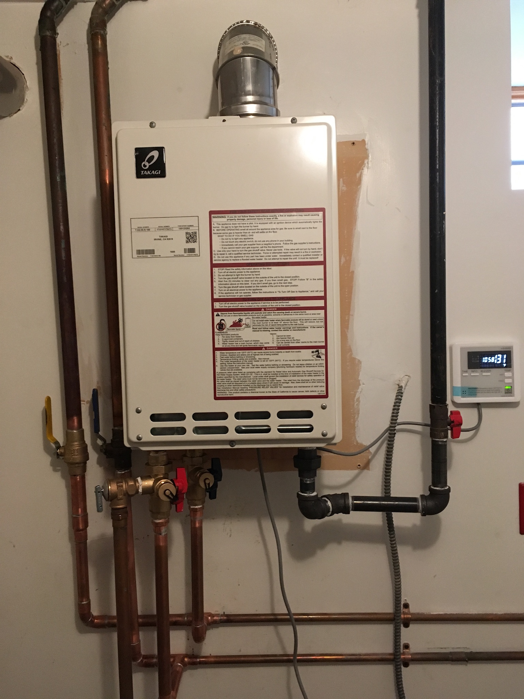
        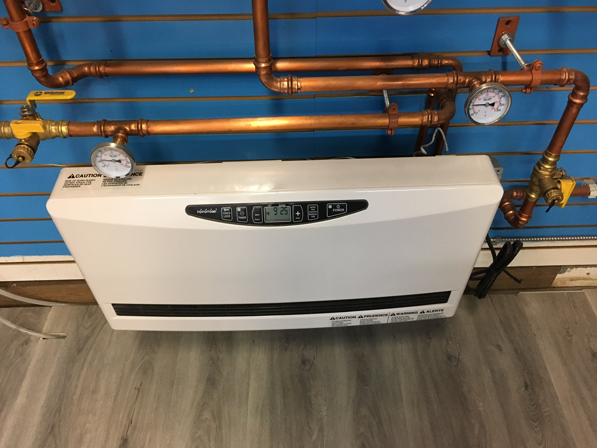
        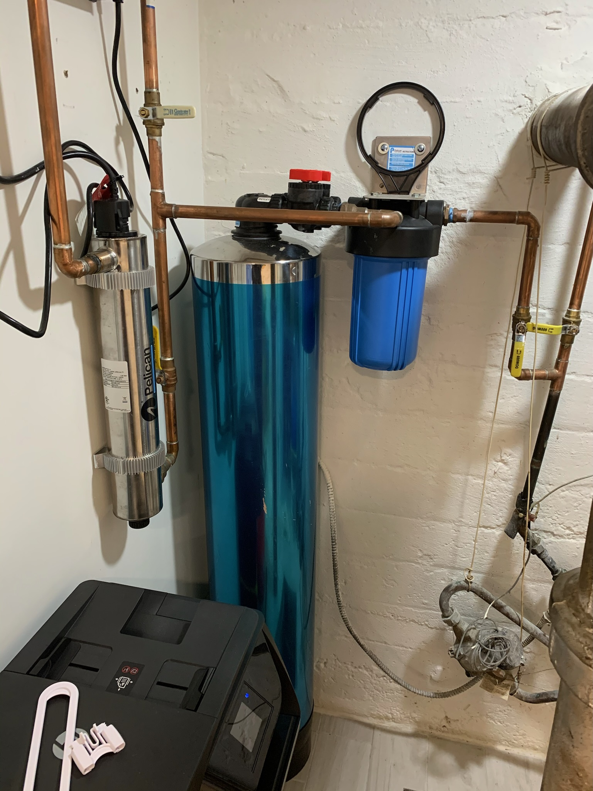
      

    

  </section>

  <!-- Testimonials Section -->
  <section id="testimonials" class="py-16 lg:py-24 bg-white">
    

      <h2 class="text-3xl lg:text-4xl font-bold text-center mb-12" data-en="What Our Customers Say" data-ru="Что Говорят Наши Клиенты">What Our Customers Say</h2>
      

        

          

            

              IP
            

            

              
Ivan Petrov

              
Brooklyn, NY

            

          

          

            ⭐⭐⭐⭐⭐
          

          
"The team at Prestige Rooter fixed a stubborn kitchen clog in under an hour—saved my dinner party!"

        

        

          

            

              OI
            

            

              
Olga Ivanova

              
Brooklyn, NY

            

          

          

            ⭐⭐⭐⭐⭐
          

          
"A burst pipe flooded my basement, but Prestige Rooter's quick cleanup and repair were a lifesaver."

        

        

          

            

              DS
            

            

              
Dmitri Sokolov

              
Brooklyn, NY

            

          

          

            ⭐⭐⭐⭐⭐
          

          
"The installation of my new water heater was seamless—hot water back in no time!"

        

        

          

            

              TK
            

            

              
Tatiana Kuznetsova

              
Brooklyn, NY

            

          

          

            ⭐⭐⭐⭐⭐
          

          
"My bathroom renovation plumbing was handled with precision—everything works perfectly now."

        

        

          

            

              MG
            

            

              
Maria Gonzalez

              
Brooklyn, NY

            

          

          

            ⭐⭐⭐⭐⭐
          

          
"The 24/7 emergency service cleared a major sewer backup overnight—relief at last!"

        

        

          

            

              JC
            

            

              
John Carter

              
New Jersey

            

          

          

            ⭐⭐⭐⭐⭐
          

          
"The rapid response to my burst pipe prevented major water damage—highly impressed!"

        

      

      

        
      

    

  </section>

  <!-- Contact Section -->
  <section id="contact" class="gradient-bg text-white py-16 lg:py-24">
    

      <h2 class="text-3xl lg:text-4xl font-bold text-center mb-12" data-en="Contact Us" data-ru="Свяжитесь с нами">Contact Us</h2>
      

        

          <h3 class="text-2xl font-bold mb-6" data-en="Get in Touch" data-ru="Свяжитесь с нами">Get in Touch</h3>
          
          

            

              

                📍
              

              

                
Address

                
24 Manhattan Court, Brooklyn, NY 11223

              

            

            

              

                📞
              

              

                
Phone

                <a href="tel:347-276-3160" class="text-yellow-300 hover:text-yellow-200 text-lg">347-276-3160</a>
              

            

            

              

                ✉️
              

              

                
Email

                <a href="mailto:Prestigerooter@gmail.com" class="text-yellow-300 hover:text-yellow-200">Prestigerooter@gmail.com</a>
              

            

            

              

                🕒
              

              

                
Hours

                
Mon-Fri: 7 AM - 7 PM

                
Emergency Services Available 24/7

              

            

          

          

            <h4 class="text-xl font-semibold mb-4" data-en="Service Areas" data-ru="Районы Обслуживания">Service Areas</h4>
            

              

                
Brooklyn

                <ul class="space-y-1 text-gray-300">
                  <li>Sheepshead Bay</li>
                  <li>Brighton Beach</li>
                  <li>Coney Island</li>
                  <li>Bay Ridge</li>
                </ul>
              

              

                
Staten Island

                <ul class="space-y-1 text-gray-300">
                  <li>New Springville</li>
                  <li>Eltingville</li>
                  <li>Tottenville</li>
                  <li>Richmond</li>
                </ul>
              

              

                
New Jersey

                <ul class="space-y-1 text-gray-300">
                  <li>Bayonne</li>
                  <li>Jersey City</li>
                  <li>Hoboken</li>
                  <li>Union City</li>
                </ul>
              

            

          

        

        

          

            <h3 class="text-2xl font-semibold mb-6 text-center" data-en="Request a Quote" data-ru="Запросить Расчет">Request a Quote</h3>
            <form onsubmit="handleFormSubmit(event)" class="space-y-4">
              

                <label for="name" class="block mb-2 font-medium" data-en="Full Name *" data-ru="Полное Имя *">Full Name *</label>
                <input type="text" id="name" required class="w-full p-3 border border-gray-300 rounded-lg focus:border-blue-500 focus:ring-2 focus:ring-blue-200 outline-none transition-colors" placeholder="John Smith">
              

              

                

                  <label for="phone" class="block mb-2 font-medium" data-en="Phone *" data-ru="Телефон *">Phone *</label>
                  <input type="tel" id="phone" required class="w-full p-3 border border-gray-300 rounded-lg focus:border-blue-500 focus:ring-2 focus:ring-blue-200 outline-none transition-colors" placeholder="(555) 123-4567">
                

                

                  <label for="email" class="block mb-2 font-medium" data-en="Email" data-ru="Эл. почта">Email</label>
                  <input type="email" id="email" class="w-full p-3 border border-gray-300 rounded-lg focus:border-blue-500 focus:ring-2 focus:ring-blue-200 outline-none transition-colors" placeholder="john@email.com">
                

              

              

                <label for="service" class="block mb-2 font-medium" data-en="Service Needed" data-ru="Необходимая Услуга">Service Needed</label>
                <select id="service" class="w-full p-3 border border-gray-300 rounded-lg focus:border-blue-500 focus:ring-2 focus:ring-blue-200 outline-none transition-colors">
                  <option value="">Select a service...</option>
                  <option value="emergency">Emergency Plumbing</option>
                  <option value="drain">Drain & Sewer Services</option>
                  <option value="water-heater">Water Heater Services</option>
                  <option value="bathroom">Bathroom Plumbing</option>
                  <option value="kitchen">Kitchen Plumbing</option>
                  <option value="heating">Heating & Boiler Services</option>
                  <option value="commercial">Commercial Services</option>
                  <option value="other">Other</option>
                </select>
              

              

                <label for="message" class="block mb-2 font-medium" data-en="Describe Your Issue" data-ru="Опишите Вашу Проблему">Describe Your Issue</label>
                <textarea id="message" class="w-full p-3 border border-gray-300 rounded-lg focus:border-blue-500 focus:ring-2 focus:ring-blue-200 outline-none transition-colors" rows="4" placeholder="Please describe the plumbing issue you're experiencing..."></textarea>
              

              <button type="submit" class="w-full bg-blue-900 hover:bg-blue-800 text-white px-6 py-4 rounded-lg font-semibold text-lg transition-colors flex items-center justify-center">
                📧
                Send Request
              </button>
            </form>

            

              

                🕒 Quick Response: We typically respond within 1 hour during business hours!
              

            

          

        

      

    

  </section>

  <!-- Footer -->
  <footer class="bg-gray-900 text-white py-12">
    

      

        

          

            

              
            

            

              <h3 class="text-xl font-bold">Prestige Rooter Inc.</h3>
              
Since 2005

            

          

          
Your trusted family-owned plumbing company serving Brooklyn, Staten Island, and New Jersey with reliable, professional services.

        

        

          <h4 class="text-lg font-semibold mb-4">Quick Links</h4>
          <ul class="space-y-2 text-sm">
            <li><a href="#home" class="text-gray-300 hover:text-white transition-colors">Home</a></li>
            <li><a href="#about" class="text-gray-300 hover:text-white transition-colors">About Us</a></li>
            <li><a href="#services" class="text-gray-300 hover:text-white transition-colors">Services</a></li>
            <li><a href="#testimonials" class="text-gray-300 hover:text-white transition-colors">Testimonials</a></li>
            <li><a href="#contact" class="text-gray-300 hover:text-white transition-colors">Contact</a></li>
          </ul>
        

        

          <h4 class="text-lg font-semibold mb-4">Services</h4>
          <ul class="space-y-2 text-sm">
            <li>Emergency Plumbing</li>
            <li>Drain Cleaning</li>
            <li>Water Heaters</li>
            <li>Bathroom Plumbing</li>
            <li>Commercial Services</li>
          </ul>
        

        

          <h4 class="text-lg font-semibold mb-4">Contact Info</h4>
          

            
📍 24 Manhattan Court Brooklyn, NY 11223

            
📞 <a href="tel:347-276-3160" class="hover:text-white transition-colors">347-276-3160</a>

            
✉️ <a href="mailto:Prestigerooter@gmail.com" class="hover:text-white transition-colors">Prestigerooter@gmail.com</a>

          

        

      

      

        

          
&copy; 2025 Prestige Rooter Inc. All rights reserved.

          

            <a href="#" class="text-gray-400 hover:text-white transition-colors">Privacy Policy</a>
            <a href="#" class="text-gray-400 hover:text-white transition-colors">Terms of Service</a>
            <a href="#" class="text-gray-400 hover:text-white transition-colors">Licensed & Insured</a>
          

        

      

    

  </footer>

  
</body>
</html>
